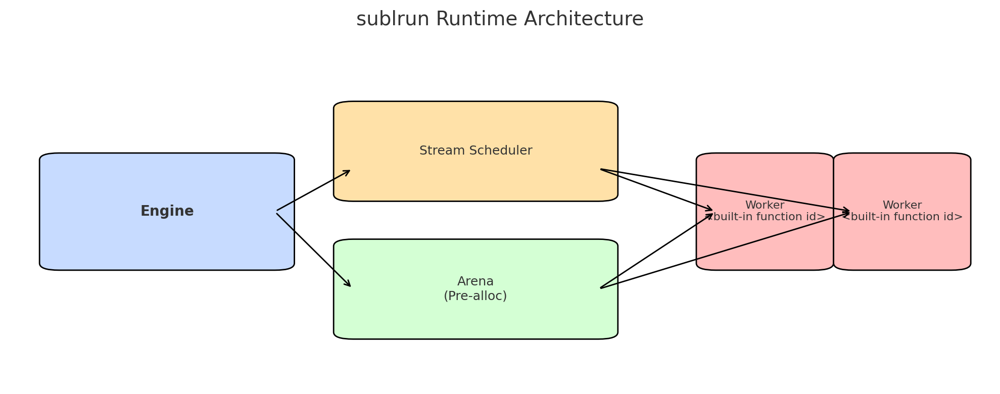

# Sublation – Architecture Overview (May 2025)

> **TL;DR**  
> *Compile‑time data‑flow, run‑time streaming.*  
> No global tensors – every compute block is a **Sublate** with local **dual byte‑buffers**.

---

## 1 · Build → Run pipeline  

| Stage | Artifact | What happens |
|-------|----------|--------------|
| **Model Spec** (`*.subs`) | Declarative graph & literals | Hand‑edited text DSL. |
| **Compiler `sublc`** | `*.subl` binary | Parse → validate → optional topological reorder → aligned payload emit. |
| **Runtime `sublrun`** | arena `[]byte` in RAM | mmap‑copies payload, spawns stream‑scheduler, feeds worker goroutines. |

---

## 2 · Runtime architecture  

* **Engine** – owns immutable graph, kernel catalogue, decides arena size.  
* **Stream‑Scheduler** – dependency solver that emits *TaskGroups* ready for execution.  
* **Arena** – single pre‑allocated byte slice; no further allocations.  
* **Worker goroutines** – pop TaskGroups, run kernels in‑place on arena slices.

A live snapshot of which Sublates hit which core looks like this:

---

## 3 · Memory model (Arena)  

1. **Model Payload** – immutable parameters at offset 0.  
2. **Sublate metadata** – per‑node offsets, flags, topology.  
3. **Scratch buffers** – reused temp slices (soft‑max, conv windows …).  
4. **Streaming input window** – active batch.  
5. **Free tail** – 32‑byte aligned head‑room for growth / hot‑swap.

---

## 4 · Sublate struct (dual‑buffer)  

Each Sublate carries *previous* and *proposed* payload buffers plus neighbour links, allowing lock‑free double‑buffer updates and later fusion.

A single inference tick:

---

## 5 · Package map (source → responsibility)

| Package | Role |
|---------|------|
| **`core/`** | alignment helpers, `Sublate` struct, zero‑alloc pools |
| **`compiler/`** | DSL parser, graph optimiser, binary writer |
| **`model/`** | immutable graph + (de)serialisers |
| **`kernels/`** | SIMD kernels (`asm_amd64.s`) + pure‑Go fall‑backs |
| **`runtime/`** | Engine, Arena, StreamScheduler |
| **`cmd/*`** | CLI tools – `sublc`, `sublrun`, `sublperf` |
| **`tests/`** | E2E smoke & perf assertions |

---

## 6 · Future extensions

* **Graph‑wise quantisation** – introduce `FlagQuant8` in `core/sublate.go`, emit 8‑bit payload variants.  
* **Dynamic kernel fusion** – the “qualitative leap” above: Scheduler merges Sublates when Δloss < ε.  
* **GPU back‑end** – drop‑in `kernels/opencl/`; Engine picks at runtime.  
* **Auto‑diff pass** – compiler emits reverse graph so training re‑uses the same runtime.  

---

Last edited 27 May 2025
